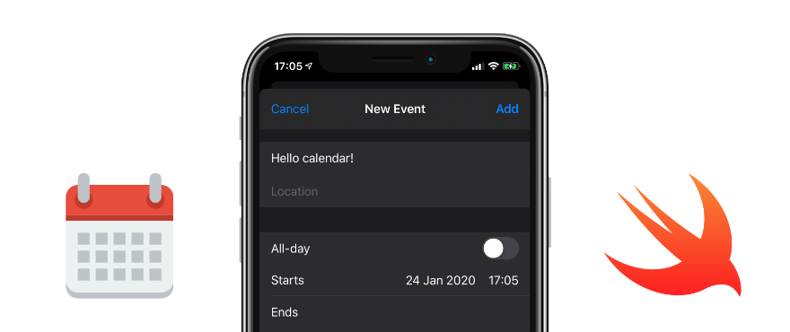

# EKEventEditViewController.Example

## Simple example how to use `EKEventEditViewController`

### More information available on [Dev.to](https://dev.to/nemecek_f/how-to-use-ekeventeditviewcontroller-in-swift-to-let-user-save-event-to-ios-calendar-d8)

You can also check `EKCalendarChooser` [example](https://github.com/nemecek-filip/EKCalendarChooser.Example). :-)